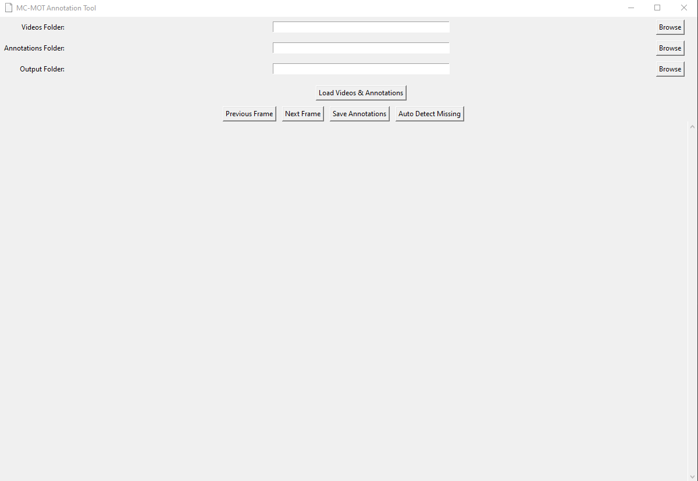

<p align="center">
  
</p>

# 🎥 Multi-Camera MOT Annotation Tool

A **semi-automatic multi-camera annotation system** designed to help you efficiently annotate, track, and re-identify objects across multiple synchronized camera views.

> 🛠️ Ideal for **multi-camera tracking datasets**, such as MOT, ReID, and surveillance scenarios.

---

## ✨ Features

- 🗂 **Multi-video loader** with synchronized playback frames
- 📦 **Annotation creator & editor** with full mouse controls
- 🧠 **Auto-detection** and cross-camera ID propagation
- 🧭 **Resume progress** with checkpointing
- 🧰 Designed for combined **manual precision** and **automated speed**

---

## 🚀 Getting Started

### 1. Launch the Tool

Upon launch, the tool prompts for:

- 🎞️ **Video Folder** – Select the folder containing your camera videos.
- 📝 **Annotation Folder** – Choose a folder to load/save annotations.  
   *If annotation files in MOT-Sytle not provided, the tool creates it automatically in the same video folder.*

> 💡 **Tip:** Set the **same folder** for input/output annotations to avoid losing progress.

---

## 🖱️ Controls & Interactions

| Action | Description |
|--------|-------------|
| 👆 **Left Click + Drag** | Create a bounding box and assign an object ID |
| 👉 **Right Click** | Edit the ID or delete a bounding box |
| 🖱️ **Middle Click (Mouse Wheel)** | Drag and move bounding boxes |
| ⬅️➡️ **Left/Right Arrow Keys** | Navigate frames backward/forward |
| 🔍 **Auto Detect Button** | Automatically detect objects and assign IDs across cameras |

---

## 🧠 Auto Detection

Click **"Auto Detect Missing"** to:
- Automatically detect missing bounding boxes.

> 🧬 Useful for speeding up the annotation process and reducing manual effort.

---

## 🛑 Resume Where You Left Off

Before quitting:
- The tool saves a `checkpoint_frame.json` file.
- On next launch, it will offer to **resume from last frame**.

### 📌 Want to jump to a specific frame?

Edit the `checkpoint_frame.json` manually and set your desired frame index.

---
## 📤 Export

- Store annotation file, compatible with popular MOT-style annotation formats.
- Each file is named per camera and frame, including bounding boxes and IDs etc.

---

## 📋 TODOs & Improvements

- 🎨 Refine the UI layout and interaction responsiveness
- 🧬 Improve local/global **re-identification logic**
- 🧾 Add more annotation format for output. 
- 🧠 Incorporate **AI tracking & association** across cameras
- 🤖 Add more automatic features (suggestions welcome!)

---

## 💡 Tips & Best Practices

- ✅ **Use the same folder for input/output annotations** to preserve progress.
- 💾 Save frequently and use the checkpoint feature to avoid losing work.
- 🔁 Review auto-detected boxes before saving to ensure accuracy.

---

## 🛠 Requirements

- Python 3.7+
- Tkinter
- OpenCV
- NumPy
- torchreid
- [Optional] PyTorch / YOLO model for Auto Detection (if implemented)

---

## ❤️ Contributions & Feedback

Suggestions, improvements or question are welcome!  
Please [open an issue](https://github.com/nasazzam/MC-MOT-Annotation-Tool/issues) or [pull request](https://github.com/nasazzam/MC-MOT-Annotation-Tool/pulls) directly to contribute to this evolving tool.

---

## 📚 Citation

If you use this tool in your research or publications, please cite the following paper:

```bibtex
@inproceedings{khan2025multicamera,
  title     = {MP-MCWT: Message Passing Strategy For Multi-Camera Worker Tracking in Construction},
  author    = {Nasrullah Khan, Dohyeong Kim, Minju Kim, Daeho Kim, Dongmin Lee},
  journal = {Automation in Construction},
  year      = {2025},
  note    = {Under review},
}
