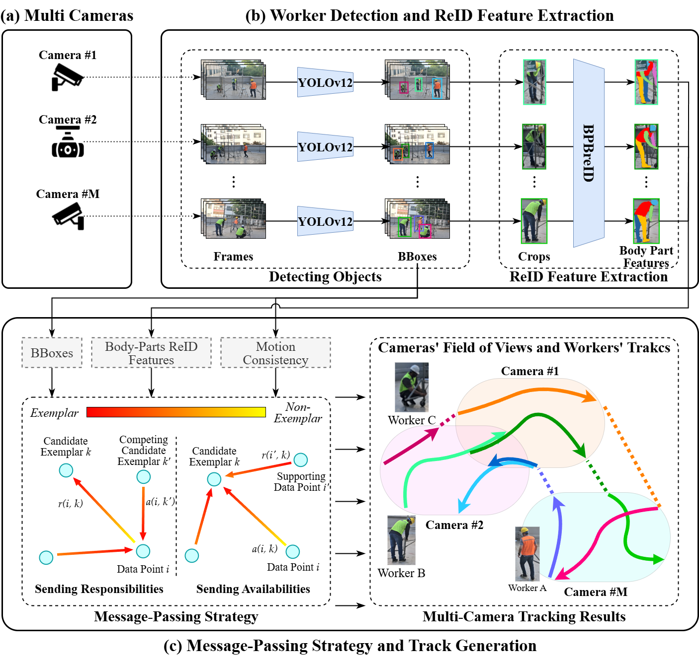

# 📄 Message-Passing Framework for Multi-Camera Worker Tracking in Construction

Official repository for the paper:  
**"Message-Passing Framework for Multi-Camera Worker Tracking in Construction"**  
*Nasrullah Khan¹, Dohyeong Kim², Minju Kim³, Daeho Kim⁴, Dongmin Lee⁵*  
<!-- Published in *[Conference/Journal Name]*, 2025.   -->
[[📄 Paper (arXiv)]](https://papers.ssrn.com/sol3/papers.cfm?abstract_id=5122800)

---

<p align="center">
  
</p>

## 📝 Abstract
> In recent years, computer vision (CV)-based tracking systems have gained significant attention for monitoring the safety and productivity of construction workers. However, current methods struggle with identity association in environments where workers wear similar attire, experience frequent occlusions, and move through distinct camera views. These challenges, common in construction sites, often lead to fragmented trajectories, ID switches, and reduced tracking reliability. To address these challenges, we propose a tracking system that detects workers in individual camera views and integrates these single-camera observations to create multi-camera tracks using a re-identification model and message-passing. To enhance feature extraction for occluded workers and those wearing similar protective gear, we utilize a region-based re-identification model that generates more accurate and refined features. During data association, message-passing incorporates localization and motion consistency to facilitate effective clustering and overall track generation. Experimental results show significant improvements in tracking accuracy, with identification F1 scores (IDF1) of 68.30 for controlled scenes and 85.10 for outdoor environments, accompanied by MOTA scores of 79.7 and 79.2, respectively. The results on the CAMPUS benchmark further validated our approach’s generalization capability, achieving competitive performance on two of its challenging multi-camera sequences. These findings validate that the attained IDF1 and MOTA performance satisfies the operational thresholds required for field deployment, confirming the robustness of the approach under diverse and dynamic construction scenarios. Consequently, the framework provides a robust solution for automated multi-camera monitoring, supporting enhanced safety management and operational performance. 
---
## 📌 Dataset Overview
The dataset consists of:
- **Images**: Raw frames captured from multiple construction site cameras.
- **Annotations**: Corresponding tracking annotations folder for gt and pred.

## 🔗 Download Links
- 📷 **Images**: [Google Drive Link](https://drive.google.com/drive/folders/1nvm1ACDlEFRBNd4Pj2XfU_EeDPr9u96_?usp=sharing1)  
- 🗒️ **Annotations**: [Google Drive Link](https://drive.google.com/drive/folders/1U7jVx6r-dZfAcwdzVtlL1lFD_7wOX-i1?usp=sharing1)   (place them in data folder)


## 📂 Repository Structure
```text
├── data/ # Dataset 
├── model/ # (model for annotation)
├── annotatior.py # annotation tool script
├── checkpoint_frame.json/ # Store history for annotation tool
├── cmd.txt # one-line command for eval script
├── eval.py # Evaluation script
└── README.md # Project documentation
```

## Eval
```text
> git clone https://github.com/username/MP-MCWT.git
cd MP-MCWT
pip install pymotmetrics
run from cmd.txt
```


================================ Annotations Tool ================================

## 🎥 Multi-Camera MOT Annotation Tool

A **semi-automatic multi-camera annotation tool** that loads multiple video streams and displays them in a canvas grid layout. This enables side-by-side comparison, tracking, and annotation of the same object from multiple views. It supports bounding box creation, ID management, and object re-identification across all cameras, designed to help you efficiently annotate, track, and re-identify objects across multiple camera views.
> 🛠️ Ideal for **multi-camera tracking datasets**, such as MOT, ReID, and surveillance scenarios.

---

## ✨ Features

- 🗂 **Multi-video loader** with synchronized playback frames
- 📦 **Annotation creator & editor** with full mouse controls
- 🧠 **Auto-detection** and cross-camera ID propagation
- 🧭 **Resume progress** with checkpointing
- 🧰 Designed for combined **manual precision** and **automated speed**

---

## 🚀 Getting Started

### 1. Launch the Tool

Upon launch, the tool prompts for:

- 🎞️ **Video Folder** – Select the folder containing your camera videos.
- 📝 **Annotation Folder** – Choose a folder to load/save annotations.  
   *If annotation files in MOT-Sytle not provided, the tool creates it automatically in the same video folder.*

> 💡 **Tip:** Set the **same folder** for input/output annotations to avoid losing progress.

---

## 🖱️ Controls & Interactions

| Action | Description |
|--------|-------------|
| 👆 **Left Click + Drag** | Create a bounding box and assign an object ID |
| 👉 **Right Click** | Edit the ID or delete a bounding box |
| 🖱️ **Middle Click (Mouse Wheel)** | Drag and move bounding boxes |
| ⬅️➡️ **Left/Right Arrow Keys** | Navigate frames backward/forward |
| 🔍 **Auto Detect Button** | Automatically detect objects and assign IDs across cameras |

---

## 🧠 Auto Detection

Click **"Auto Detect Missing"** to:
- Automatically detect missing bounding boxes.

> 🧬 Useful for speeding up the annotation process and reducing manual effort.

---

## 🛑 Resume Where You Left Off

Before quitting:
- The tool saves a `checkpoint_frame.json` file.
- On next launch, it will offer to **resume from last frame**.

### 📌 Want to jump to a specific frame?

Edit the `checkpoint_frame.json` manually and set your desired frame index.

---
## 📤 Export

- Store annotation file, compatible with popular MOT-style annotation formats.
- Each file is named per camera and frame, including bounding boxes and IDs etc.

---

## 📋 TODOs & Improvements

- 🎨 Refine the UI layout and interaction responsiveness
- 🧬 Improve local/global **re-identification logic**
- 🧾 Add more annotation format for output. 
- 🧠 Incorporate **AI tracking & association** across cameras
- 🤖 Add more automatic features (suggestions welcome!)

---

## 💡 Tips & Best Practices

- ✅ **Use the same folder for input/output annotations** to preserve progress.
- 💾 Save frequently and use the checkpoint feature to avoid losing work.
- 🔁 Review auto-detected boxes before saving to ensure accuracy.

---

## 🛠 Requirements

- Python 3.7+
- Tkinter
- OpenCV
- NumPy
- torchreid
- Ultralytics
- [Optional] PyTorch (CUDA) for Auto Detection 

---

## ❤️ Contributions & Feedback

Suggestions, improvements or question are welcome!  
Please [open an issue](https://github.com/nasazzam/MC-MOT-Annotation-Tool/issues) or [pull request](https://github.com/nasazzam/MC-MOT-Annotation-Tool/pulls) directly to contribute to this evolving tool.

---

## 📚 Citation

If you use this tool in your research or publications, please cite the following paper:

```bibtex
@inproceedings{khan2025multicamera,
  title     = {MP-MCWT: Message-Passing Framework for Multi-Camera Worker Tracking in Construction},
  author    = {Nasrullah Khan, Dohyeong Kim, Minju Kim, Daeho Kim, Dongmin Lee},
  journal = {Automation in Construction},
  year      = {2025},
  note    = {Under review},
}
